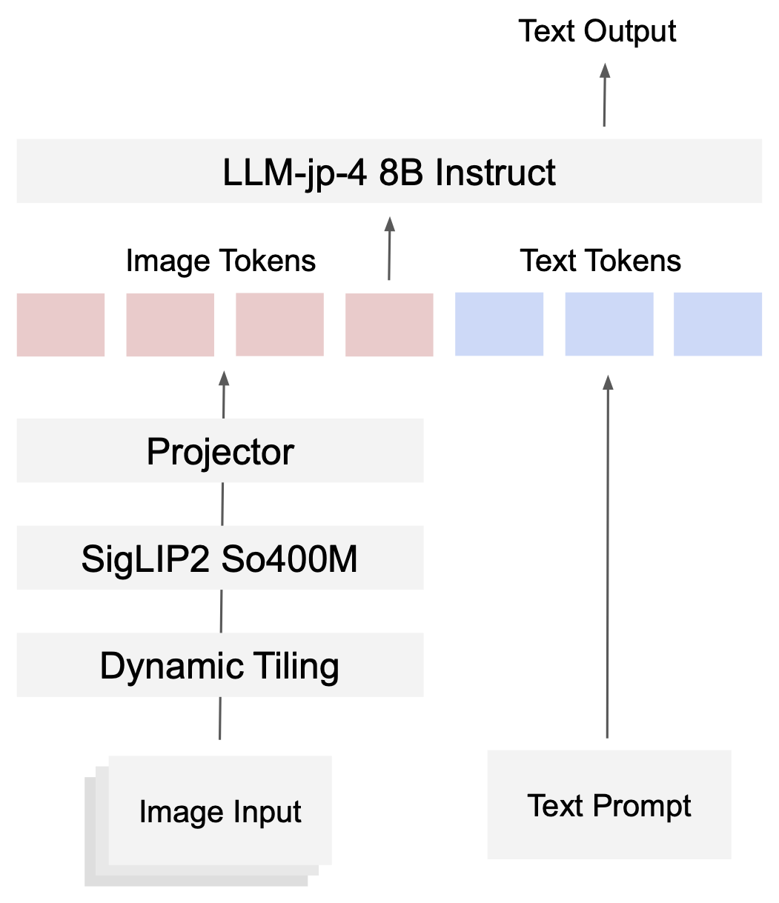

<div align="center" style="line-height: 1;">
<h1>LLM-jp-4-VL</h1>


  |
  <a href="https://huggingface.co/llm-jp/llm-jp-4-vl-9b-beta" target="_blank">🤗 Model</a>
  &nbsp;|
  <a href="https://llm-jp.github.io/blog/" target="_blank">📄 Blog</a>
  &nbsp;|
  <a href="https://github.com/llm-jp/llm-jp-4-vl" target="_blank">🧑‍💻 Code</a>
  &nbsp;|

  <br/>
<div align="center">
<figure>
  
</figure>
</div>
</div>

LLM-jp-4-VL is the vision-language model developed by LLM-jp.


## Usage
Install dependencies:
```bash
uv sync
```

Below is an example code for inference.
```python
import torch
from transformers import AutoProcessor, AutoModel

model_id = "llm-jp/llm-jp-4-vl-9B-beta"

# load model
model = (
    AutoModel.from_pretrained(
        model_id,
        torch_dtype=torch.bfloat16,
        trust_remote_code=True,
        use_flash_attn=True,
    )
    .eval()
    .cuda()
)

processor = AutoProcessor.from_pretrained(model_id, trust_remote_code=True)


def generate(messages, max_new_tokens=256, temperature=0.0):
    inputs = processor.apply_chat_template(
        messages,
        tokenize=True,
        add_generation_prompt=True,
        return_dict=True,
        return_tensors="pt",
    ).to(model.device)

    if "pixel_values" in inputs:
        inputs["pixel_values"] = inputs["pixel_values"].to(dtype=model.dtype)

    outputs = model.generate(
        **inputs,
        max_new_tokens=max_new_tokens,
        do_sample=temperature > 0,
        temperature=temperature if temperature > 0 else None,
    )

    text = processor.decode(outputs[0], skip_special_tokens=False)
    text = text.replace("<|channel|>final<|message|>", "")
    text = text.replace("<|return|>", "")
    text = text.replace(processor.tokenizer.eos_token, "")
    return text.strip()

messages = [
    {
        "role": "user",
        "content": [
            {"type": "image", "image": "assets/tweet.png"},
            {"type": "text", "text": "ツイート内容を全て抜き出してください"},
        ],
    }
]
```

For more details, please refer to the code in `codebooks` directory.

## Evaluation Reproduction
To reproduce the evaluation results, please refer to our [simple-evals-mm](https://github.com/llm-jp/simple-evals-mm) repository.


## Citation
If you find our work useful, please consider citing the following papers:
```bibtex
@misc{sugiura2026jaglebuildinglargescalejapanese,
      title={Jagle: Building a Large-Scale Japanese Multimodal Post-Training Dataset for Vision-Language Models},
      author={Issa Sugiura and Keito Sasagawa and Keisuke Nakao and Koki Maeda and Ziqi Yin and Zhishen Yang and Shuhei Kurita and Yusuke Oda and Ryoko Tokuhisa and Daisuke Kawahara and Naoaki Okazaki},
      year={2026},
      eprint={2604.02048},
      archivePrefix={arXiv},
      primaryClass={cs.CV},
      url={https://arxiv.org/abs/2604.02048},
}

@misc{sugiura2026jammevalrefinedcollectionjapanese,
      title={JAMMEval: A Refined Collection of Japanese Benchmarks for Reliable VLM Evaluation},
      author={Issa Sugiura and Koki Maeda and Shuhei Kurita and Yusuke Oda and Daisuke Kawahara and Naoaki Okazaki},
      year={2026},
      eprint={2604.00909},
      archivePrefix={arXiv},
      primaryClass={cs.CV},
      url={https://arxiv.org/abs/2604.00909},
}
```
